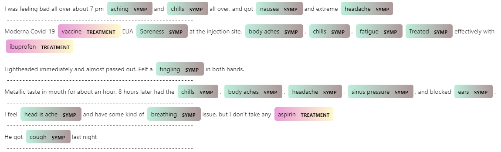

# Fine-tune a BERT model for NER task in HuggingFace 

# Introduction

The code is based on HuggingFace's example (https://huggingface.co/transformers/custom_datasets.html#token-classification-with-w-nut-emerging-entities).

# Data

First of all, we need to prepare a dataset file in the BIO/IOB2 formart.
This dataset file could be a lot of format, and here we use a very simple plain text BIO/IOB2 format.

A sample file could be found here: http://noisy-text.github.io/2017/files/wnut17train.conll

In this case, we’ll just download the train set, which is a single text file. Each line of the file contains either (1) a word and tag separated by a tab, or (2) a blank line indicating the end of a document. Let’s write a function to read this in. 
We’ll take in the file path and return token_docs which is a list of lists of token strings, and token_tags which is a list of lists of tag strings.
In this repo, we also provide a sample file `dataset.tsv` which contains COVID-19 Vaccination symptoms and treatment related annotations. 

After installing the required packages, we could start fine-tuning with customized dataset.

```bash
python hf_fine_tuning_ner.py
```

When the fine-tuning is finished, a fine-tuned model will be saved in the `fine-tuned-model` folder for future use. 
We prepared a sample program to show how to load the saved fine-tuned model.

```bash
python hf_predict.py
```

We also prepared a jupyter notebook to show the whole process.
In this notebook, we use spaCy to visualize the prediction result.
The predicted entities will be marked as HTML for display and it will look like the following:

